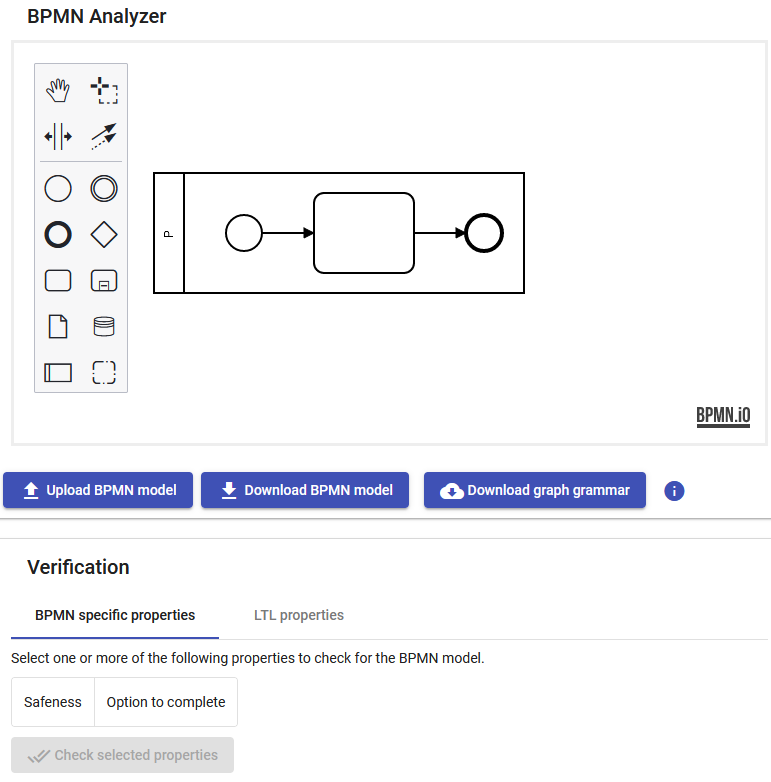

# Groove_Rule_Generation
Generates graph-transformation rules for the graph-transformation tool [Groove](https://groove.ewi.utwente.nl/about) from different behavioral languages (mostly BPMN).

## Contained projects
This repository contains multiple related projects.
1. **generator** contains the source code to generate Groove rules from different behavioral languages, for example, BPMN.
2. **generation-ui** contains the ui code for the generation of Groove rules from BPMN files. Including model-checking of BPMN models.
3. **server** contains server code hosting the ui and some services used by it.

## BPMN generation
A demo version of the tool is also hosted [here](https://bpmn-analyzer.herokuapp.com/).

Go [here](/server/README.md) if you want to run the tool to generate graph-transformation rules for BPMN locally
